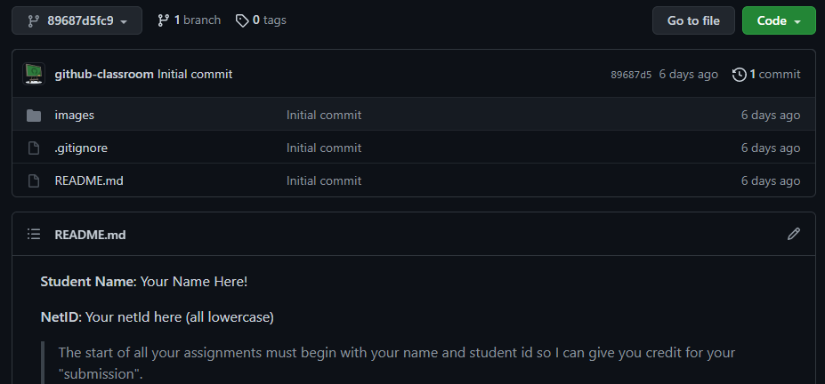
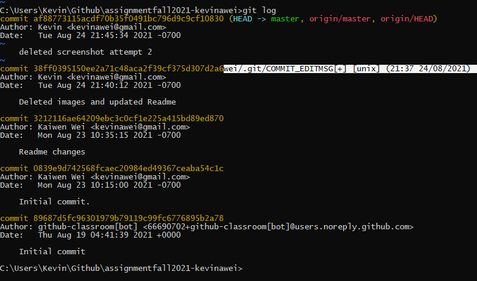

**Student Name**:  Kaiwen Wei

**NetID**: rs6975

# Homework #1 Solutions

## Question 1 (Headings and Screenshots)

### (a) 


### (b) 

## Question 2 (Code Samples)

### (a) 

### (b)

### (c)

## Question 3

### (a) 

### (b)

## Question 4

### (a) 
1. Java
2. Python
3. Javascript

### (b)
- Windows
- MacOS

### (c)
- Visual Studio Code
- Eclipse

## Question 5

### (a) 

## Java Code Snippet

```java
for (x=10; x>0>; x++){
    System.out.println(x+"Seconds left until I am done with Question 5 part a!");
    TimeUnit.SECONDS.sleep(1);
}
System.out.println("Question 5 part a complete!");

```
### (b)

[Link to Colormind (color palette generator)](http://colormind.io)