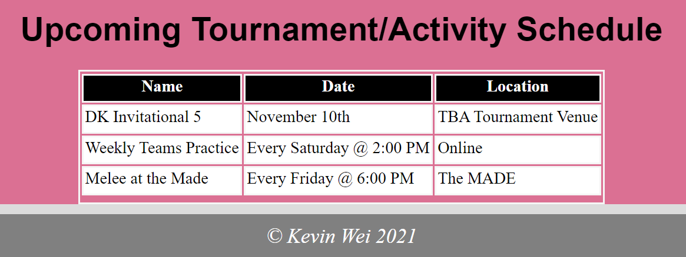
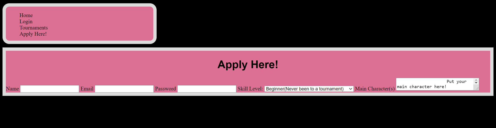
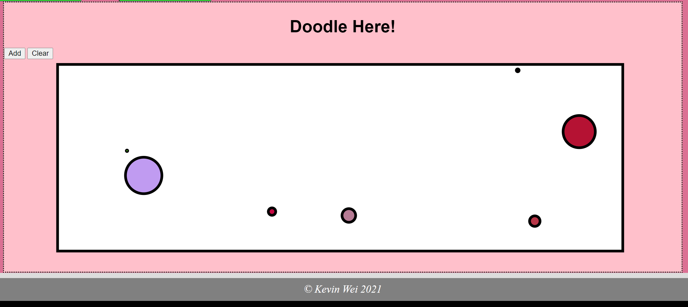
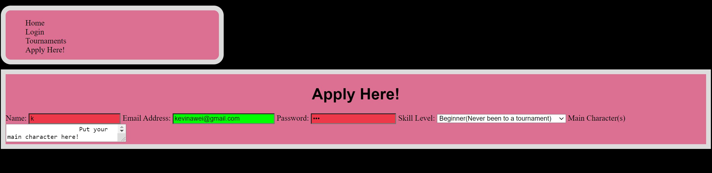
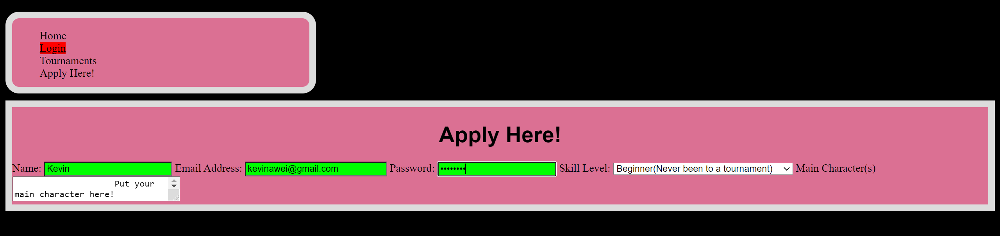
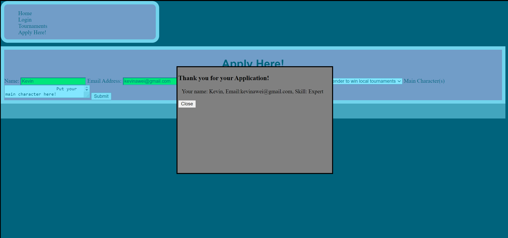

**Student Name**:  Kaiwen Wei

**NetID**: rs6975

# Homework #4 Solutions

## Question 1

### (a) 
```javascript
let events = [{"name": "DK Invitational 5",
           "date": ["November 10th"],
           "location": "TBA Tournament Venue"},

         {"name": "Weekly Teams Practice",
          "date": ["Every Saturday @ 2:00 PM"],
        "location": "Online"},

         {"name": "Melee at the Made", 
         "date": ["Every Friday @ 6:00 PM"],
         "location": "The MADE"}
        ];
```


### (b) 

### (c)

```javascript
    let table = document.getElementById("myTable");
    let row = table.insertRow(1);
    var cell1 = row.insertCell(0);
    var cell2 = row.insertCell(1);
    var cell3 = row.insertCell(2);

    cell1.innerHTML = events[0].name;
    cell2.innerHTML = events[0].date;
    cell3.innerHTML = events[0].location;

    let row2 = table.insertRow(2);
    var cell4 = row2.insertCell(0);
    var cell5 = row2.insertCell(1);
    var cell6 = row2.insertCell(2);

    cell4.innerHTML = events[1].name;
    cell5.innerHTML = events[1].date;
    cell6.innerHTML = events[1].location;

    let row3 = table.insertRow(3);
    var cell7 = row3.insertCell(0);
    var cell8 = row3.insertCell(1);
    var cell9 = row3.insertCell(2);

    cell7.innerHTML = events[2].name;
    cell8.innerHTML = events[2].date;
    cell9.innerHTML = events[2].location;
```

## Question 2

### (a) 


### (b) 
```html
<nav>
  <ul>
    <li><a href="index.html">Home</a></li>
    <li><a href="login.html">Login</a></li>
    <li><a href="tournaments.html">Tournaments</a></li> 
    <li><a href="application.html">Apply Here!</a></li>   
  </ul>
</nav>
```
### (c)

## Question 3

### (a) 
```html
<div class="doodle">
  <h1>Doodle Here!</h1>
  <button>Add</button>
  <button>Clear</button>
  <svg width="500" height="100">
    <rect width="1060" height = "350" />
  </svg>
</div>
```

### (b) 


```javascript
let mySVG = document.getElementById("board");
var numCircles = 0;
var maxSize = 40,
    maxX = 1060,
    maxY=350;

function newCircle(){
    var svgns = "http://www.w3.org/2000/svg";

    let x = Math.random()*(maxX - maxSize);
    let y = Math.random()*(maxY - maxSize);
    let radius = Math.random()*maxSize;

    let circle = document.createElementNS(svgns, "circle");

    console.log("new circle");
    circle.setAttribute("cx", x);
    circle.setAttribute("cy", y);
    circle.setAttribute("r", radius);

    let colorStr = `rgb(${255*Math.random()}, ${255*Math.random()}, ${255*Math.random()})`;
    circle.setAttribute("fill", colorStr);

    return circle;
}
function drawCircle(){
    mySVG.appendChild(newCircle());
    numCircles++;
}
function clearSVG(){
    console.log("clear button pressed");
    for (let i =0; i<numCircles; i++) {
        mySVG.removeChild(mySVG.lastChild);
    }
    numCircles = 0;
    return mySVG;
}


document.getElementById("add").addEventListener("click", drawCircle);
document.getElementById("clear").addEventListener("click", clearSVG);
```

## Question 4

### (a) 




```html
<form id="application">
  <label for="name">Name:</label>
  <input type="text" id="name" name="name" required minlength="4" maxlength="20" size="22">

  <label for="email">Email Address:</label>
  <input type="text" id="email" pattern=".+[a-z]{2,4}" name="email" required minlength="10" maxlength="24" size="25">

  <label for="pass">Password:</label>
  <input type="password" id="pass" name="password" required minlength="4" maxlength="18" size="20">

  <label for="skill">Skill Level:</label>
  <select name="skill" id="skill">
    <option value="Beginner">Beginner(Never been to a tournament)</option>
    <option value="Novice">I've been to a tournament before</option>
    <option value="Intermediate">I've been to many tournaments</option>
    <option value="Expert">I'm a contender to win local tournaments</option>
    <option value="Master">I'm a Top 100 player</option>
  </select>
  <label>Main Character(s)</label>
    <textarea name="message" rows="2" cols="30">
      Put your main character here!
    </textarea>
  <button type="button" onclick="thanks()">Submit</button>
</form>
```

### (b) 


### (c)

```css
.hide{
    display: none;
}
#dialog{
    border: 3px solid black;
    background-color: grey;
    min-height: 300px;
    padding: 2px;
    z-index: 3;
  }
```

```javascript
function thanks(){
  var cover = document.getElementById("cover");
  var below = document.getElementById("below");
    var form = document.getElementById("application");
  var text = document.getElementById("text");
  var thankYou = document.getElementById("dialog");
        
  thankYou.classList.toggle("hide");
  thankYou.classList.add('show');
                        
  console.log("check");
                        
  var name = "Your name: " + application.elements['name'].value;
  var email = ", Email:" + application.elements['email'].value;
  var level = ", Skill: " + application.elements['skill'].value;
        
  var result = name + email + level;
        
  text.innerText = result;

  cover.classList.add('obscure');
}
function closeMsg(){
  console.log("check2");
  var thankYou = document.getElementById("dialog");
  var cover = document.getElementById("cover");
  thankYou.classList.toggle("hide");
  thankYou.classList.toggle("show");
  cover.classList.toggle('obscure');
                    }
```

