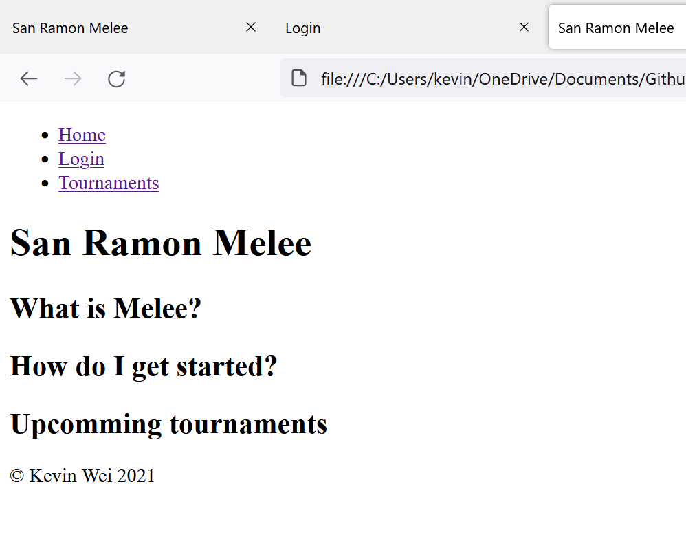
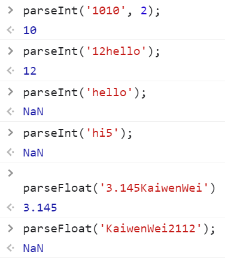
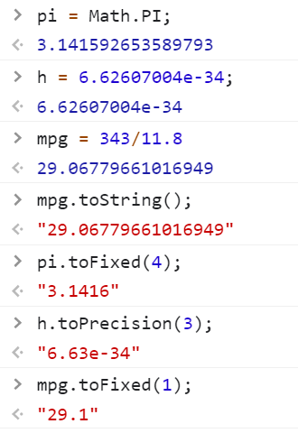
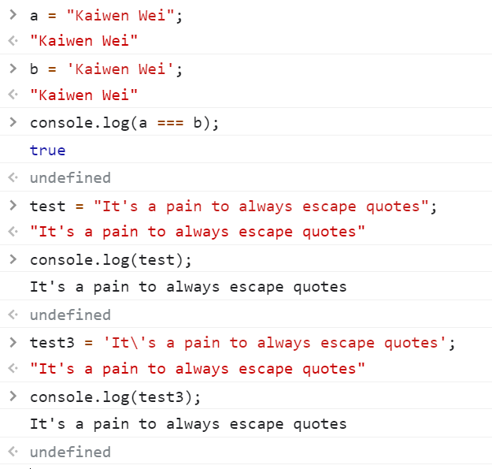
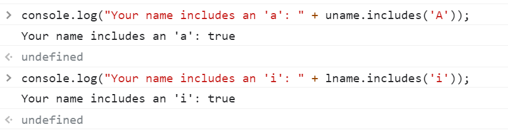
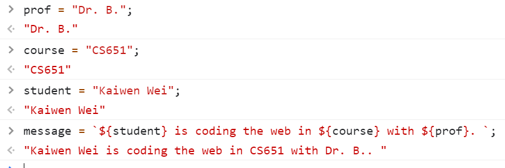
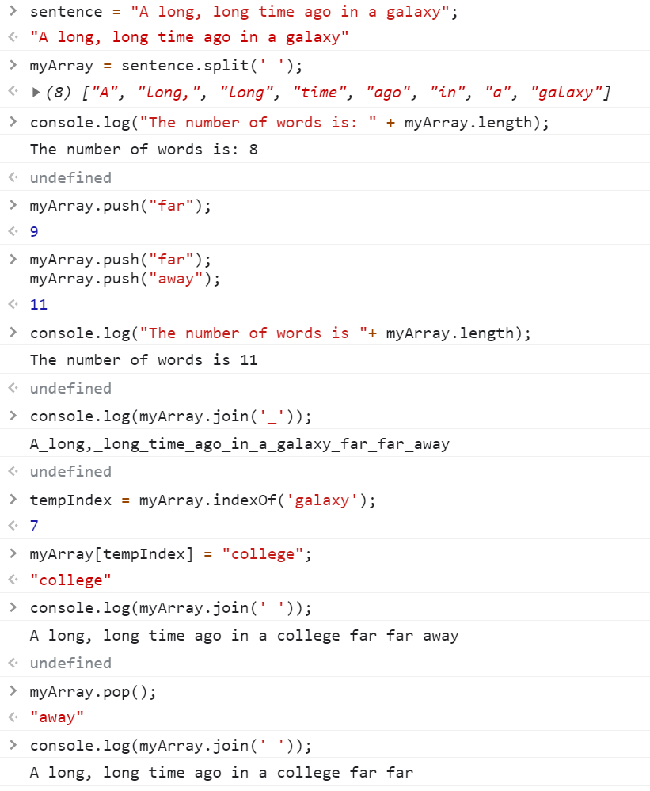
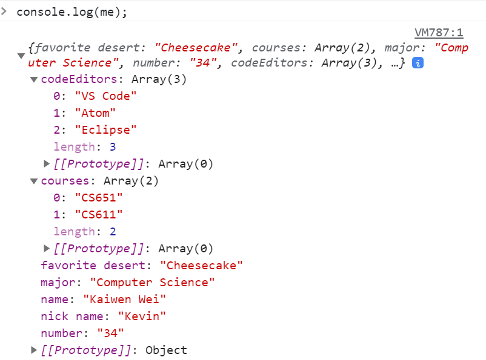
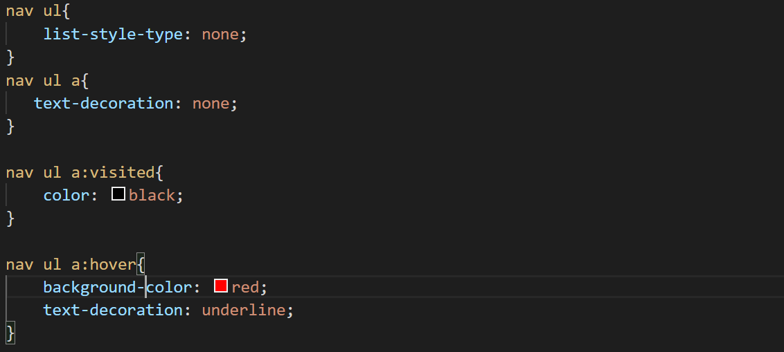
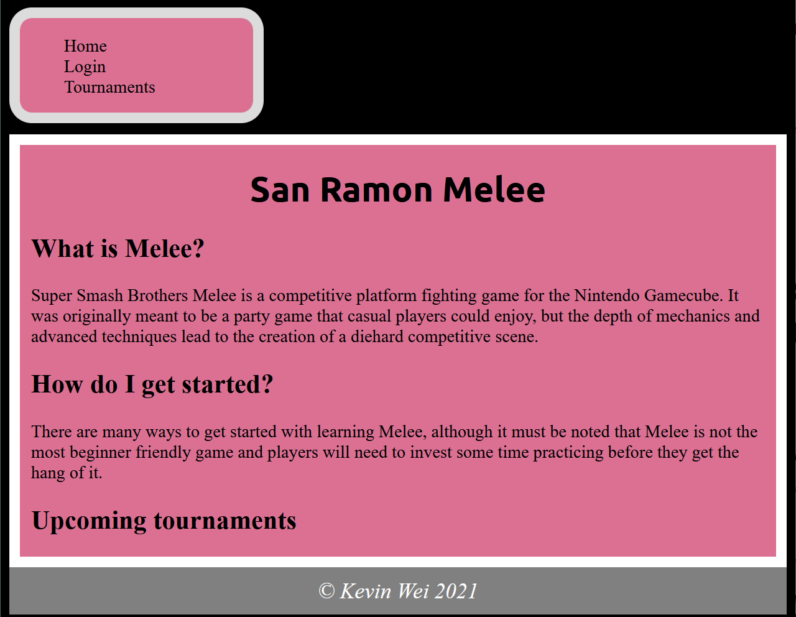

**Student Name**:  Kaiwen Wei

**NetID**: rs6975

# Homework #2 Solutions

## Question 1 (Headings and Screenshots)

### (a) 


### (b) 
- index.html
- login.html
- tournaments.html
## Question 2

### (a) 
We should put the header outside the main .

### (b)
Similarly to the header, we should include the footer outside of main. It should be the last element in the body if we want it to 
show up as the last element on the page. This ensures that nothing will ever appear below it and that we can segment the page by header -> main -> footer
### (c)


### (d)
```html
<!DOCTYPE html>

<html>
    <head>
        <meta charset="utf-8">
        <title>San Ramon Melee</title>
        <link rel="stylesheet" href="style.css">
    </head>
    <body>
        <header>
            <nav>
                <ul>
                    <li><a href="index.html">Home</a></li>
                    <li><a href="login.html">Login</a></li>
                    <li><a href="tournaments.html">Tournaments</a></li>   
                </ul>
            </nav>
        </header>
        <main>
            <h1>San Ramon Melee</h1>
            <h2>What is Melee?</h2>
            <p>
                Super Smash Brothers Melee is a competitive platform fighting game for the Nintendo Gamecube.
                It was originally meant to be a party game that casual players could enjoy, but the depth of 
                mechanics and advanced techniques lead to the creation of a diehard competitive scene.
            </p>
            <h2>How do I get started?</h2>
            <p>
                There are many ways to get started with learning Melee, although it must be noted that
                Melee is not the most beginner friendly game and players will need to invest some time practicing
                before they get the hang of it.
            </p>

            <h2>Upcoming tournaments</h2>
        </main>
        <footer>© Kevin Wei 2021</footer>
    </body>
</html>
```

## Question 3

### (a) String to number conversions
- (i) NaN means "not a number", which is the result because 'hello' is a string and not a number.
- (ii) 
- (iii) This converts 1010 from binary to decimal.
- (iv) The result here is NaN, whereas in (ii) the result is 5 (because of the order that the number appears in the string)



### (b) Number to Strings



### (c) Single and Double quote strings
- (i) Yes, the single quote shows up in the log
- (ii) This doesn't work because the single quote that appears is matched with the starting single quote and thus causes a syntax error
- (iii) The character \ is used to escape characters in JavaScript, which allows us to use a single quote in the string without causing an error



### (d) Simple string manipulations
- (i) toUpperCase takes the name String and changes each character to uppercase
- (ii) toLowerCase takes the name String and changes each character to lowercase
- (iii) includes() checks if a String contains a certain character and returns true if it does and false if not



### (e) Backticks and template strings



## Question 4

### (a) Array Basics
- (i) This splits the sentence String into an array by separating it by the spaces.
- (ii) These calls add Strings to myArray using the push() method.
- (iii) join() joins all of the elements in the array together into one string separated by "_" 
- (iv) This gives the index of 'galaxy' in the array
- (v) Yes this changes the element 'galaxy' to 'college' in the array
- (vi) This removes the last element in the array


### (b) Fancier Array Methods
- (i) This takes a string and returns the String in all uppercase
- (ii) The map function makes a new array with each element being the String returned by the given function 
- (iii) Converting all strings to lowercase ensures that the sorting is accurate even if some elements are uppercase and some are lowercase
- (iv) Passing the function ensures that the sort ignores case when sorting


### (c) Objects
- (i) We have to use a different syntax because the field name has a space in it
- (ii) Yes
- (iii) 
- (iv) 



## Question 5

### (a) 
Using Ubuntu Bold 700

### (b)



### (c)


